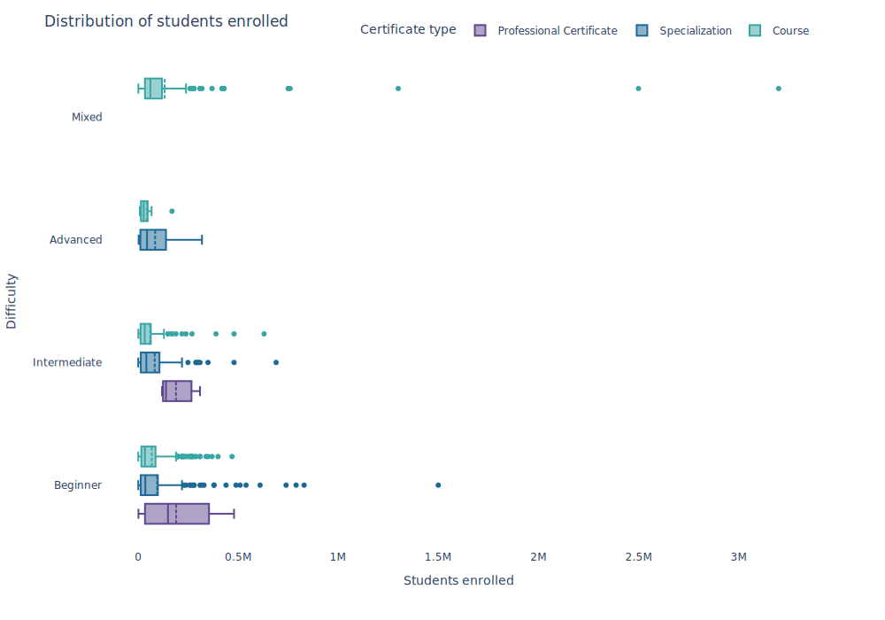

# DA.PY.3.5

## License

This project is licensed under the GNU General Public License v3.0 (GPLv3). You may find the full text in the ["License"](https://github.com/TuringCollegeSubmissions/avabal-PYDA.3.5/blob/main/License.txt) file. 

### Dataset License

This project uses the Coursera Course Dataset from [Kaggle](https://www.kaggle.com/datasets/siddharthm1698/coursera-course-dataset). The dataset is licensed under the [GNU General Public License v2 (GPL 2)](https://www.gnu.org/licenses/old-licenses/gpl-2.0.en.html).